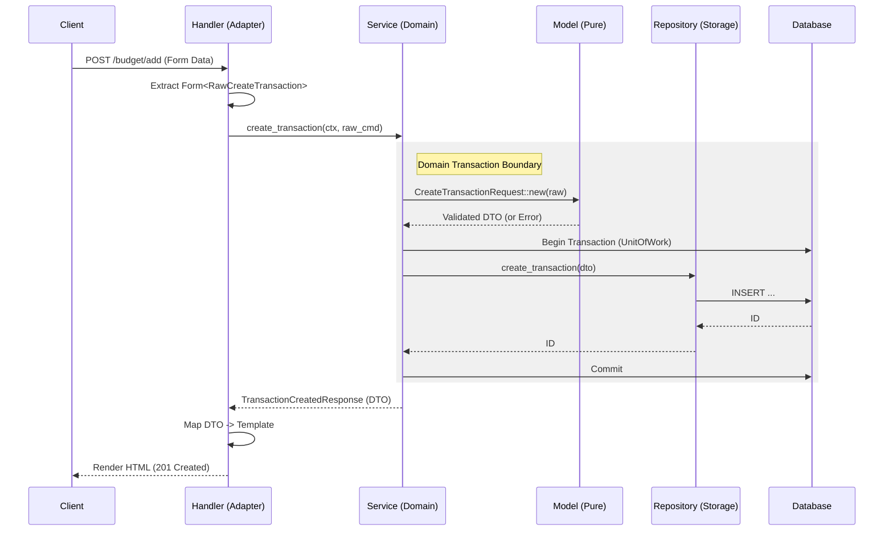

# Gemini Project: Budgeting App

This document provides a comprehensive overview of the `budget` project, its architecture, and development conventions to be used as instructional context for future interactions.

## Project Overview

This is a Rust-based web application for personal budgeting. It tracks income and expenses using a month-by-month view and supports inline editing for a seamless user experience.

*   **Main Technologies:**
    *   **Backend:** Rust
    *   **Web Framework:** Axum
    *   **Database:** SQLite
    *   **Database Interface:** SQLx
    *   **Async Runtime:** Tokio
    *   **Templating:** Askama (Type-safe HTML)
    *   **Frontend:** Vanilla JavaScript (for inline editing)
    *   **Authentication:** Shared Secret (Password-protected instance)

*   **Architecture:** The project follows a deliberate, modern Rust architecture guided by the `architecture_guide.md` document. Key principles include:
    *   **Cargo Workspace:** The application is split into a multi-crate workspace to improve compilation times and enforce strict boundaries.
    *   **Vertical Slicing:** The codebase is organized by business domain (`transactions`, `categories`) rather than by technical layer.
    *   **Layered Architecture:** Within each domain crate, a layered approach (Handler, Service, Repository, Model) is used to separate concerns.
    *   **Dependency Flow:** Dependencies flow inwards: the main `app` crate depends on the domain crates, and the domain crates depend on the `database` and `common` infrastructure crates.

The main crates in the workspace are:
*   `app`: The binary crate that acts as the composition root, wiring together configuration, the database, and routing.
*   `crates/database`: The infrastructure crate that handles all database connection logic, transaction management (Unit of Work pattern), and migrations.
*   `crates/common`: A shared infrastructure crate for common data structures like `AppState` and `Config`.
*   `crates/transactions`: A domain crate for managing income and expenses.
*   `crates/categories`: A domain crate for managing budget buckets and limits.

## Building and Running

### **Environment Setup**

The application requires a `.env` file in the `budget` directory for configuration. This file should contain the following variables:

```env
# The connection string for the SQLite database
DATABASE_URL="sqlite:budget.db"

# The port for the application to run on
PORT="3000"
```

### **Key Commands**

All commands should be run from the `budget` directory.

*   **Build:**
    ```sh
    cargo build
    ```

*   **Check for Errors (faster than build):**
    ```sh
    cargo check
    ```

*   **Run the Application:**
    ```sh
    cargo run -p app
    ```
    The application will start and listen on the port specified in the `.env` file (defaulting to 3000).

*   **Run Tests:**
    ```sh
    cargo test
    ```

### **Database Migrations**

The application uses `sqlx-cli` to manage database migrations. The migration files are located in `budget/crates/database/migrations`. The application is configured to run these migrations automatically on startup.

To create a new migration, you would typically use:
```sh
# (Assuming sqlx-cli is installed: cargo install sqlx-cli)
sqlx migrate add -r <migration_name> --source ./crates/database/migrations
```

## Database Schema (SQLite)

The database design uses **Integer Cents** to store monetary values to avoid floating-point errors.

### 1. Categories Table (Static Definitions)
*   `id`: INTEGER PRIMARY KEY AUTOINCREMENT
*   `name`: TEXT UNIQUE NOT NULL

### 2. Cards Table (Static Definitions)
*   `id`: INTEGER PRIMARY KEY AUTOINCREMENT
*   `name`: TEXT UNIQUE NOT NULL
*   `is_active`: BOOLEAN DEFAULT 1

### 3. Monthly Budgets Table (Variable Limits)
*   `id`: INTEGER PRIMARY KEY AUTOINCREMENT
*   `category_id`: INTEGER NOT NULL (FK)
*   `month`: TEXT NOT NULL (YYYY-MM)
*   `limit_amount`: INTEGER DEFAULT 0 (Cents)
*   `UNIQUE(category_id, month)`

### 4. Transactions Table
*   `id`: INTEGER PRIMARY KEY AUTOINCREMENT
*   `category_id`: INTEGER NOT NULL (FK)
*   `card_id`: INTEGER (FK) -- Nullable (e.g. Cash)
*   `transaction_date`: TEXT NOT NULL (ISO-8601 `YYYY-MM-DD`)
*   `amount`: INTEGER NOT NULL (Cents, Positive=Income, Negative=Expense)
*   `notes`: TEXT
*   `created_at`: TEXT DEFAULT CURRENT_TIMESTAMP

## UI/UX Design

### Authentication (Instance Level)
The application is protected by a single shared password defined at startup.
1.  **Login Page:** A simple, focused page with a password input.
2.  **Session:** Successful login creates a secure, signed session cookie.
3.  **Protection:** All budget and data routes are protected by middleware that redirects unauthenticated users to the login page.

### Month View Layout
The user interface is centered around a single month view.

1.  **Navigation & Initialization:**
    *   Top controls to switch the currently viewed month.
    *   **Auto-Copy Logic:** When navigating to a new month, if no `MonthlyBudgets` exist, the system automatically copies the budget entries (category limits) from the most recent previous month.

2.  **Financial Overview (Dashboard):**
    *   **Total Income:** Aggregates all income transactions.
    *   **Tithing:** Calculated as 10% of Total Income.
    *   **Total Expenses:** Sum of all expenses.
    *   **Net Balance:** Income - Expenses.

### 2a. Virtual / Derived Categories (Service Layer)
To support advanced tracking without complex database splits, the application implements **Virtual Categories** in the Budget Summary view.
*   **Total Income:** Automatically summed from all positive transactions.
*   **Tithing:** Automatically calculated as 10% of Total Income.
*   **Split Categories (e.g., Auto Insurance):**
    *   Transactions are entered under a real category (e.g., "Car Insurance").
    *   The Budget View *virtually* splits this category into sub-buckets (e.g., "Auto (Mazda)" and "Auto (Elantra)") based on predefined rules (e.g., 50/50 split) for reporting purposes.

3.  **Budget Summary (Top Table):**
    *   Manages **Categories** for the specific month.
    *   **Columns:** Checkbox (Filter), Category Name, Monthly Limit, Spent, Remaining, Actions.
    *   **Interactive:**
        *   **Filter:** Checking a box filters the bottom transactions table to show only that category.
            *   **Edit:** Clicking a limit turns it into an input to update the budget for *this month*.
            *   **Add Category:** A row to add a new category limit for this month.
            *   **Color Coding:** Each category has an assigned pastel color.
                *   **Auto-Select:** New categories get a random pastel color.
                *   **Customization:** User can choose from a palette of ~20 pastel colors.
                *   **Visuals:** Category table rows and Transaction table "Category" cells are tinted with this color.
        
        4.  **Transactions Table (Bottom Table):**    *   Displays transactions, filtered by the summary table selection.
    *   **Columns:** Date, **Card**, Category, Amount, Notes, Actions.
    *   **Amount Input:** Amounts are always entered as positive numbers. An "Income" checkbox toggles the sign (Income = Positive, Expense = Negative).
    *   **Visuals:** Expenses are displayed in **Red**, Income in **Green**.
    *   **Type-Ahead Selection:** All Card and Category dropdowns (both in the table and filters) must support typing to search/select the closest match.
    *   **Sorting & Filtering:**
        *   Sort by: Date (default), Category, Amount, Card.
        *   Filter by: Date Range, Specific Card.
    *   **Card Column:** A dropdown showing only `is_active` cards.
    *   **Add Row:** Sticky footer to add new transactions.

5.  **Global Settings:**
    *   **Manage Cards:** A modal or separate small view to Create/Rename/Deactivate cards.

### Data Visualization
To provide better financial insights, the application includes interactive charts powered by **Chart.js**:
1.  **Budget vs. Spent (Bar Chart):** A grouped bar chart comparing the "Budget Limit" vs. "Actual Spent" for each category in the current month.
2.  **Expense Distribution (Pie Chart):** A breakdown showing the percentage of total expenses contributed by each category.

---
# **Gold Standard Rust Web Architecture**

This document outlines the structural decisions, patterns, and data flow for a high-quality, maintainable Rust web service using Axum and SQLx. For this example, we will consider a simple app centered around performing CRUD operations on a Transactions table.

## **Core Philosophy: Separation of Concerns & Compilation Performance**

The architecture is designed to enforce strict boundaries, maximize Codegen Parallelism, and ensure long-term maintainability.

1. **Vertical Slicing:** Logic is grouped by **Domain** (e.g., `Transactions`, `Categories`), not by Technical Layer (e.g., Models, Repositories).
2. **Workspace Isolation:** Domains exist in separate crates. This ensures that changes to one domain do not trigger a recompilation of another.
3. **Dependency Flow:** Dependencies flow inwards (or downwards). The App depends on Domains; Domains depend on Infrastructure.

## **1. Workspace Layout**

We utilize a Cargo Workspace to split the monolith into compilation units.
```text
budget/
├── Cargo.toml            # Workspace definition
├── crates/
│   ├── database/         # Shared Infrastructure ("The Plumbing")
│   ├── transactions/     # Domain Crate (Vertical Slice)
│   ├── categories/       # Domain Crate
│   └── common/           # Shared Types
└── app/                  # The Application Root ("The Binary")
```

### **Dependency Flow**

```mermaid
graph TD
    App[app (Binary)] --> Trans[crates/transactions (Domain)]
    App --> Cats[crates/categories (Domain)]
    Trans --> DB[crates/database (Infra)]
    Cats --> DB
    App -.->|Init Only| DB
```

* `app` -> `transactions`
* `transactions` -> `database`
* `app` -> `database` (For initialization only)

## **2. The Infrastructure Crate (`crates/database`)**

**Responsibility:** "The Plumbing." Encapsulates all external database dependencies (`sqlx`), connection logic, and transaction management. This ensures domain crates remain agnostic to the specific driver implementation.

### **Key Patterns**

* **The "Driver Adapter" Pattern (Feature Flags):**
  * Defines `sqlite` feature.
  * Exports Type Aliases (`pub type Connection = sqlx::SqliteConnection`) so consuming crates do not need generic parameters.
* **Unit of Work:**
  * Wraps a `sqlx::Transaction`.
  * Exposes `connection()` so Repository layers in other crates can attach to the active transaction.
* **Testing Infrastructure:**
  *   Exposes `get_test_db()` (only in `#[cfg(test)]`) to provide isolated database instances for integration tests.
  *   **Strategy:** We use SQLite's `:memory:` mode or temporary files to spin up isolated databases. This ensures tests are fast and reproducible.

## **3. The Domain Crates (`crates/transactions`, `crates/categories`)**

Responsibility: Encapsulates all logic for a specific business vertical. Each domain crate contains four standard layers internally.

**Visibility Rule:** Only the **Handler** and **Service** layers should be public to the outside world (the `app` crate). The **Repository** and **Internal Models** should often be `pub(crate)` to enforce encapsulation and prevent bypassing business rules.

```rust
// crates/transactions/src/lib.rs
pub mod models;       // Public DTOs (Opaque Domain Entities)
mod repository;       // pub(crate) - Private to this crate
pub mod service;      // Public API for other domains/app
pub mod handler;      // Public Router
```

### A. Models Layer (`transactions::models`)

Responsibility: Defines the common language and data shapes of the system.
Dependencies: None (Pure Data).

* **Encapsulation & Integrity (The "Opaque" Pattern):**
  *   Domain Entities and DTOs that represent *validated* state should have **private fields**.
  *   Access is granted via public getters.
  *   **Why?** This guarantees that if you hold an instance of `Transaction`, it is valid. No external code can modify a field and put the object into an invalid state.
* **Deserialization Rule:**
  *   **Validated DTOs must NOT implement `Deserialize`.**
  *   *Why?* `serde` can bypass private fields and constructors, allowing invalid state to be injected.
  *   **Pattern:** Create a separate `RawRequest` struct (public fields, `Deserialize`) for the Handler to parse JSON. Then convert `RawRequest` -> `ValidatedRequest` via a `new()` or `try_from()` method.
* **Domain Entities:** (e.g., `Transaction`)
  * Decoupled from SQL-specific types (no `sqlx` attributes here).
* **DTOs:** (e.g., `CreateTransactionRequest`)
  * Define the contract with external API clients.
* **Validation (Structural):**
  * **Parse, don't validate.** Logic resides strictly in `DTO::new()`.
  * **Tooling:** Use the `validator` crate for declarative rules instead of writing manual `if` statements.
  * This layer guarantees *Structural Integrity* (e.g., "Date is ISO-8601").
  * It does *not* check database state.
### **B. Repository Layer (`transactions::repository`)**

Responsibility: "The Storage Mechanism." Maps Domain objects to SQL rows.
Dependencies: `database`, `models`.

* **Visibility:** `pub(crate)`. The `app` crate should never access the repository directly. It must go through the Service.
* **Internal Records:**
  * Defines private structs (e.g., `TransactionRecord`) that derive `FromRow`.
  * Implements `TryFrom<TransactionRecord>` for the Domain Entity to handle conversion logic, keeping the public Entity clean.
* **Specialization:**
  * Accepts `&mut database::Connection`.

### **C. Service Layer (`transactions::service`)**

Responsibility: "The Orchestrator." Enforces business rules and manages transaction scopes.
Dependencies: `database`, `repository`, `models`.

* **Context Awareness:** Service methods should accept a `UserContext` (if authentication is added) to enforce authorization rules alongside business logic.
* **Signature Rule (Command Objects):**
  * Service methods accept **Primitive Rust Types** OR **Command Structs** (e.g., `CreateTransactionCommand` with public fields).
  * *Why?* The Service takes raw input and calls `DTO::new()`, forcing the Service to be the trigger for structural validation logic. Do not pass validated DTOs *into* the service.
* **Stateful Validation:**
  * Checks that rely on DB state (e.g. "Category must exist") happen here, often by querying a Repository before performing the action.
* **Transaction Management:**
  * Calls `database::Database::begin()` to start a transaction (`UnitOfWork`).
  * Passes the transaction connection to `TransactionRepository::new()`.
  * Calls `uow.commit()` only when all steps succeed.

### **D. Handler Layer (`transactions::handler`)**

Responsibility: "The View Adapter." Translates HTTP requests into Service calls and renders HTML or returns JSON.
Dependencies: `service`, `models`, `templates`.

* **Router Factory:**
  * Exposes a public function `transactions_router(state: Arc<AppState>) -> Router`.
* **Transport Logic:**
  * Uses `Form<T>` (for POSTs) or `Query<T>` extraction.
  * **Rule:** Performs no business validation. Validation is delegated to the Service/Model layers.
* **View Logic (SSR):**
  * **Mapping:** The Handler maps the **Domain DTO** returned by the Service into a **View Template** (Askama struct).
  * **Response:** Returns `impl IntoResponse` which renders the HTML template.
  * **Inline Editing:** This layer handles returning both full pages (`month_view.html`) and HTML fragments (`row_snippet.html`) for AJAX updates.

## **4. The Application Crate (`app`)**

**Responsibility:** Composition Root. Wires everything together.

1. **Configuration:** Loads environment variables into a Typed Config Struct.
2.  **Database Init:** Calls `database::new_database()`.
3.  **Routing:** Mounts domain routers.

```rust
// app/src/main.rs
let app = Router::new()
    .nest("/budget", transactions::handler::transactions_router(state.clone()))
    .nest("/categories", categories::handler::categories_router(state.clone()));
```

3. **Server:** Starts the `tokio` listener.

## **5. Configuration & 12-Factor Principles**

Never hardcode connection strings or secrets.

*   **Typed Config:** Create a `Config` struct in `app` (e.g. using `envy` or `config` crates).
*   **Fail Fast:** On startup, the app attempts to load the config from `std::env`. If a variable is missing, the app **crashes immediately** with a helpful error message. This prevents runtime errors later.

## **6. Security: Context Passing**

Authentication happens in Middleware (in `app`), but Authorization happens in the Domain.

1.  **Middleware:** Extracts the User ID.
2.  **Handler:** Extracts the User ID into a `UserContext` struct.
3.  **Service:** Accepts `&UserContext` as an argument.

## **7. Data Flow Lifecycle**

The following describes the lifecycle of a `POST /budget/add` request in an SSR context:



1. **Handler Layer (`transactions::handler`):**
   * Axum extracts payload into a raw struct via `Form<T>`.
   * Handler calls `TransactionService::create_transaction(ctx, ..., payload)`.
2. **Service Layer (`transactions::service`):**
   * Receives Command Struct.
   * Calls `CreateTransactionRequest::new()`. **(Validation & Cents Conversion happens here)**.
   * If valid, calls `db.begin()` to start **`UnitOfWork`**.
   * Initializes `TransactionRepository` with the active transaction connection.
   * Calls `repo.create_transaction(&dto)`.
3. **Repository Layer (`transactions::repository`):**
   * Receives DTO.
   * Executes SQL (`INSERT INTO ...`).
   * Returns ID.
4. **Service Layer:**
   * Orchestrates additional steps.
   * Calls `uow.commit()`.
   * Returns `TransactionCreatedResponse`.
5. **Handler Layer:**
   * Receives Response DTO.
   * Initializes a Template struct with data from the DTO.
   * Returns `impl IntoResponse` which renders the HTML.

## **8. Testing Strategy**

We prioritize **Behavioral Testing** using the real database infrastructure over mocking repositories. We focus on testing "Public Behaviors".

| Scope          | Location          | Strategy                                                                                                                                                             |
| -------------- | ----------------- | -------------------------------------------------------------------------------------------------------------------------------------------------------------------- |
| Infrastructure | `crates/database` | Verify migrations run; connections work.                                                                                                                             |
| Models         | `crates/transactions` | **Unit Tests:** Verify DTO validation logic (e.g., `CreateTransactionRequest::new`) in isolation. Test invalid inputs rigoriously.                                          |
| Domain Logic   | `crates/transactions` | **Flow Tests:** Use `database::get_test_db()` to spin up an isolated DB. Run full flows (Service -> Repo -> DB) to verify business rules and transactions.          |
| API Contract   | `crates/transactions` | **Tower Oneshot:** Use `tower::ServiceExt::oneshot` against `transactions::handler::transactions_router` to verify HTTP codes, routing, and serialization without binding to a port. |

## **9. Observability & Cross-Cutting Concerns**

Debuggability is as important as functionality.

*   **Tracing:** We use the `tracing` crate.
    *   The `app` crate initializes the `tracing_subscriber`.
    *   Domain crates instrument their functions with `#[tracing::instrument]`.
*   **Error Context:**
    *   Errors propagated from Domains to the App should contain enough context to debug.
    *   Use `thiserror` for library-level errors (Domains) and `anyhow` for application-level glue if necessary.

## **10. Error Handling Strategy**

Errors must change shape as they bubble up the stack to maintain abstraction boundaries.

| Layer | Error Type | Responsibility | Example |
| :--- | :--- | :--- | :--- |
| **Infrastructure** | `sqlx::Error` | Raw driver errors. | `DatabaseError`, `PoolTimedOut` |
| **Repository** | `RepositoryError` | Abstract storage errors. Decouples Domain from SQLx. | `NotFound`, `UniqueViolation` |
| **Service** | `DomainError` | Business rule violations. Adds semantic context. | `BudgetExceeded`, `InvalidDate` |
| **Handler** | `Axum Response` | HTTP translation. Masks internal details. | `400 Bad Request`, `500 Internal Server Error` |

### **The Translation Chain**

1.  **Repository:** The `From<sqlx::Error>` implementation for `RepositoryError` catches raw driver errors. It maps `RowNotFound` to `RepositoryError::NotFound` and constraint violations to `UniqueViolation`.
2.  **Service:** Catches `RepositoryError`. Maps `NotFound` -> `DomainError::TransactionNotFound(id)`.
3.  **Handler/Response:** Matches on `DomainError`.
    *   `TransactionNotFound` -> `404 Not Found`.
    *   `Infrastructure` -> `500 Internal Server Error` (Logs the actual error, sends a generic message to client).

## **11. Trade-off Analysis: Vertical vs. Horizontal Slicing**

We chose **Vertical Slicing (Domain Crates)** for this architecture.
| Feature     | Vertical Slicing (Our Choice)                                   | Horizontal Slicing (Layers)                                            |
| ----------- | --------------------------------------------------------------- | ---------------------------------------------------------------------- |
| Structure   | `crates/transactions`, `crates/categories`                                 | `crates/models`, `crates/services`                                     |
| Compilation | Fast. Changing transactions only rebuilds transactions.                     | Slow. Changing models rebuilds everything.                             |
| Cohesion    | High. All Transaction logic is in one place.                          | Low. Logic scattered across 3 crates.                                  |
| Visibility  | Strict. DB structs can remain private to the crate.             | Leaky. DB structs often must be public to be seen by the `Repo` crate. |
| Dependency  | Requires careful design to avoid circular deps between domains. | Impossible to have circular deps (strict hierarchy).                   |

## **12. The View Layer (Askama / SSR)**

We use **Askama** for type-safe, compiled templates.

*   **Location:** Templates live in the crate that owns them (e.g., `crates/transactions/templates/*.html`).
*   **The View Model Pattern:**
    *   **Do not** pass Domain Entities directly to templates if they have complex private fields or logic.
    *   **Do** define specific `TemplateStructs` in the Handler layer.
    *   The Handler is responsible for mapping: `ServiceDTO` -> `ViewTemplate`.
*   **Logic-Free Templates:**
    *   Templates should only contain display logic (loops, ifs).
    *   **Never** perform DB queries or business calculations inside a template. Data must be pre-calculated by the Service.

## Development Conventions

*   **Architecture:** Strictly follow the vertical slicing and layered architecture defined in `architecture_guide.md`.
*   **Error Handling:** Errors are handled in a layered fashion. Database errors are converted into `RepositoryError`, which are then converted into domain-specific `ServiceError` types, which finally get converted into HTTP responses in the handler layer.
*   **Authentication:** Authentication is nonexistent.
*   **State Management:** Application-wide state is managed in the `AppState` struct, defined in the `common` crate.
*   **Testing:** The architecture is designed to be tested with integration tests that run against a real database instance, potentially spun up using `testcontainers`.
*   **Async Trait:** Async traits have been stabilized recently, so there is no need to import the async-trait crate.
*   **Deleting large sections of code:** Avoid deleting large sections of code unless there is a specific need.
*   **TODO list:** Use GEMINI.md as a todo list. Whenever you leave a comment that could be a todo item, the task must be placed in the todo list as well.
*   **Axum url paths:** Axum url paths no longer use a colon like :id or :name. Instead, they use braces like {id} and {name}. If a colon is used, the app will error at runtime.
*   **Workspace Dependencies:** All external dependencies and internal crate dependencies should be defined in the root `Cargo.toml` under `[workspace.dependencies]`. Child crates should inherit these using `{ workspace = true }` to ensure version consistency across the project.

todo:
 » Initialize Cargo Workspace structure
 ✔ Create `crates/database` with SQLx SQLite connection and migration logic
 ✔ Create `crates/common` for shared types (`AppState`, `Config`)
 ✔ Create `crates/categories` domain (Model, Repo, Service, Handler)
 ✔ Create `crates/transactions` domain (Model, Repo, Service, Handler)
 ✔ Implement `app` crate to wire everything together
 ✔ Add SQL migration for `categories` and `transactions` tables
 ✔ Implement "Month View" in `transactions`
 ✔ Implement "Inline Editing" using Askama partials (`row_snippet.html`)
 ✔ Add unit tests for Domain Models

 ### Refactoring & New Features
 - [x] **Schema Migration**:
    - [x] Create `cards` table.
    - [x] Create `monthly_budgets` table.
    - [x] Add `card_id` to `transactions`.
    - [x] Seed default cards (Cash, Debit, Credit).
 - [x] **Authentication**:
    - [x] Add `app_password` to `Config`.
    - [x] Setup `tower-sessions` for session management.
    - [x] Implement `Login` handler and template.
    - [x] Implement Authentication Middleware to protect routes.
 - [x] **Domain: Cards**:
    - [x] Create `crates/cards` (Model, Repo, Service, Handler).
    - [x] Implement CRUD for Cards.
 - [x] **Domain: Categories**:
    - [x] Refactor to use `monthly_budgets` for limits.
    - [x] Implement "Auto-Copy" logic in Service.
 - [x] **Domain: Transactions**:
    - [x] Update Model/Repo to handle `card_id`.
 - [x] **UI/UX**:
    - [x] Implement "Financial Overview" dashboard (Income, Tithing, Expenses, Net).
    - [x] **Category Enhancements**:
        - [x] Add `color` column to `categories` table.
        - [x] Implement auto-assignment of pastel colors.
        - [x] Add color picker to Category Edit view.
        - [x] Style Category rows and Transaction Category cells with assigned colors.
    - [x] Implement "Budget Summary Table" (Top).
    - [x] Implement "Filter by Category" checkbox logic.
    - [x] Add Card Dropdown to Transaction Row.
    - [x] Create "Manage Cards" modal.
    - [x] **Transactions Table Enhancements**:
        - [x] "Income" Checkbox for Add/Edit rows (replaces negative input).
        - [x] Visual Styling (Red/Green) based on amount sign.
        - [x] Type-Ahead/Autocomplete for Category/Card inputs.
        - [x] Sorting (Date, Category, Amount, Card).
        - [x] Filtering (Date Range, Card).