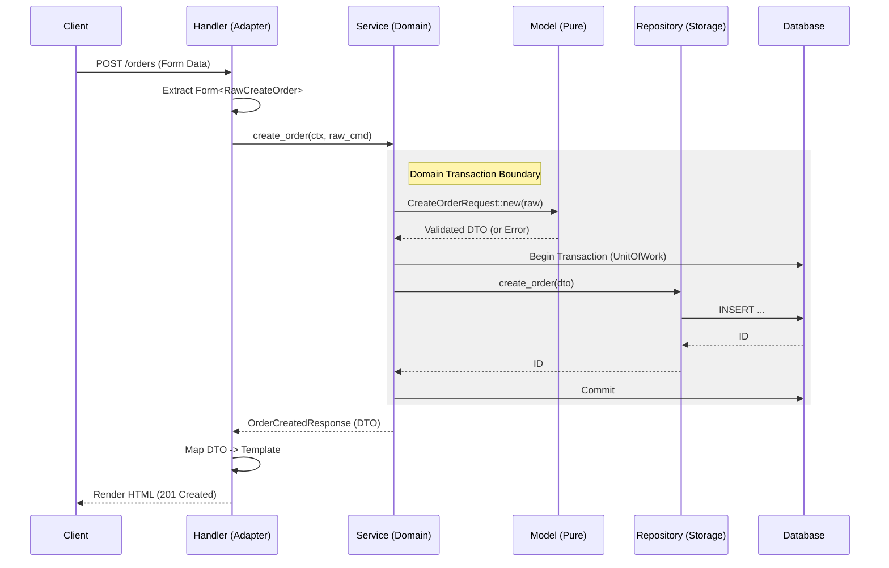

# **Gold Standard Rust Web Architecture**

This document outlines the structural decisions, patterns, and data flow for a high-quality, maintainable Rust web service using Axum and SQLx. For this example, we will consider a simple app centered around performing CRUD operations on an Orders table.

## **Core Philosophy: Separation of Concerns & Compilation Performance**

The architecture is designed to enforce strict boundaries, maximize Codegen Parallelism, and ensure long-term maintainability.

1. **Vertical Slicing:** Logic is grouped by **Domain** (e.g., `Orders`, `Users`), not by Technical Layer (e.g., Models, Repositories).
2. **Workspace Isolation:** Domains exist in separate crates. This ensures that changes to the orders domain do not trigger a recompilation of the users domain.
3. **Dependency Flow:** Dependencies flow inwards (or downwards). The App depends on Domains; Domains depend on Infrastructure.

## **1. Workspace Layout**

We utilize a Cargo Workspace to split the monolith into compilation units.
```text
my-app/
├── Cargo.toml            # Workspace definition
├── crates/
│   ├── database/         # Shared Infrastructure ("The Plumbing")
│   ├── orders/           # Domain Crate (Vertical Slice)
│   └── users/            # Future Domain Crate
└── app/                  # The Application Root ("The Binary")
```

### **Dependency Flow**

```mermaid
graph TD
    App[app (Binary)] --> Orders[crates/orders (Domain)]
    App --> Users[crates/users (Domain)]
    Orders --> DB[crates/database (Infra)]
    Users --> DB
    App -.->|Init Only| DB
```

* `app` -> `orders`
* `orders` -> `database`
* `app` -> `database` (For initialization only)

## **2. The Infrastructure Crate (`crates/database`)**

**Responsibility:** "The Plumbing." Encapsulates all external database dependencies (`sqlx`), connection logic, and transaction management. This ensures domain crates remain agnostic to the specific driver implementation.

### **Key Patterns**

* **The "Driver Adapter" Pattern (Feature Flags):**
  * Defines `postgres` feature.
  * Exports Type Aliases (`pub type Connection`) so consuming crates do not need generic parameters.
* **Unit of Work:**
  * Wraps a `sqlx::Transaction`.
  * Exposes `connection()` so Repository layers in other crates can attach to the active transaction.
* **Testing Infrastructure:**
  *   Exposes `get_test_db()` (only in `#[cfg(test)]`) to provide isolated database instances for integration tests.
  *   **Docker Strategy:** We use `testcontainers` to spin up a real PostgreSQL instance in Docker for testing. This ensures our tests run against the exact same engine as production, avoiding SQLite/Postgres parity issues.

## **3. The Domain Crates (`crates/orders`, `crates/users`)**

Responsibility: Encapsulates all logic for a specific business vertical. Each domain crate contains four standard layers internally.

**Visibility Rule:** Only the **Handler** and **Service** layers should be public to the outside world (the `app` crate). The **Repository** and **Internal Models** should often be `pub(crate)` to enforce encapsulation and prevent bypassing business rules.

```rust
// crates/orders/src/lib.rs
pub mod models;       // Public DTOs (Opaque Domain Entities)
mod repository;       // pub(crate) - Private to this crate
pub mod service;      // Public API for other domains/app
pub mod handler;      // Public Router
```

### A. Models Layer (`orders::models`)

Responsibility: Defines the common language and data shapes of the system.
Dependencies: None (Pure Data).

* **Encapsulation & Integrity (The "Opaque" Pattern):**
  *   Domain Entities and DTOs that represent *validated* state should have **private fields**.
  *   Access is granted via public getters.
  *   **Why?** This guarantees that if you hold an instance of `Order`, it is valid. No external code can modify a field and put the object into an invalid state.
* **Deserialization Rule:**
  *   **Validated DTOs must NOT implement `Deserialize`.**
  *   *Why?* `serde` can bypass private fields and constructors, allowing invalid state to be injected.
  *   **Pattern:** Create a separate `RawRequest` struct (public fields, `Deserialize`) for the Handler to parse JSON. Then convert `RawRequest` -> `ValidatedRequest` via a `new()` or `try_from()` method.
* **Domain Entities:** (e.g., `Order`)
  * Decoupled from SQL-specific types (no `sqlx` attributes here).
* **DTOs:** (e.g., `CreateOrderRequest`)
  * Define the contract with external API clients.
* **Validation (Structural):**
  * **Parse, don't validate.** Logic resides strictly in `DTO::new()`.
  * **Tooling:** Use the `validator` crate for declarative rules (e.g. `#[validate(email)]`) instead of writing manual `if` statements.
  * This layer guarantees *Structural Integrity* (e.g., "Name is not empty", "Email is well-formed").
  * It does *not* check database state (e.g., "Email is unique").
### **B. Repository Layer (`orders::repository`)**

Responsibility: "The Storage Mechanism." Maps Domain objects to SQL rows.
Dependencies: `database`, `models`.

* **Visibility:** `pub(crate)`. The `app` crate should never access the repository directly. It must go through the Service.
* **Internal Records:**
  * Defines private structs (e.g., `OrderRecord`) that derive `FromRow`.
  * Implements `TryFrom<OrderRecord>` for the Domain Entity to handle conversion logic, keeping the public Entity clean.
* **Specialization:**
  * Accepts `&mut database::Connection`.

### **C. Service Layer (`orders::service`)**

Responsibility: "The Orchestrator." Enforces business rules and manages transaction scopes.
Dependencies: `database`, `repository`, `models`.

* **Context Awareness:** Service methods should accept a `UserContext` (e.g., `user_id`, `roles`) to enforce authorization rules alongside business logic.
* **Signature Rule (Command Objects):**
  * Service methods accept **Primitive Rust Types** (e.g., `String`, `i64`) OR **Command Structs** (e.g., `CreateOrderCommand` with public fields).
  * *Why?* The Service takes raw input and calls `DTO::new()`, forcing the Service to be the trigger for structural validation logic. Do not pass validated DTOs *into* the service.
* **Stateful Validation:**
  * Checks that rely on DB state (e.g. "User must be active") happen here, often by querying a Repository before performing the action.
* **Transaction Management:**
  * Calls `database::Database::begin()` to start a transaction (`UnitOfWork`).
  * Passes the transaction connection to `OrderRepository::new()`.
  * Calls `uow.commit()` only when all steps succeed.

### **D. Handler Layer (`orders::handler`)**

Responsibility: "The View Adapter." Translates HTTP requests into Service calls and renders HTML or returns JSON.
Dependencies: `service`, `models`, `templates`.

* **Router Factory:**
  * Exposes a public function `orders_router(state: Arc<AppState>) -> Router`.
* **Transport Logic:**
  * Uses `Form<T>` (for POSTs) or `Query<T>` extraction.
  * **Rule:** Performs no business validation. Validation is delegated to the Service/Model layers.
* **View Logic (SSR):**
  * **Mapping:** The Handler maps the **Domain DTO** returned by the Service into a **View Template** (Askama struct).
  * **Response:** Returns `impl IntoResponse` which renders the HTML template.
  * *Note:* JSON APIs are optional and secondary. The primary output is server-side rendered HTML.

## **4. The Application Crate (`app`)**

**Responsibility:** Composition Root. Wires everything together.

1. **Configuration:** Loads environment variables into a Typed Config Struct.
2.  **Database Init:** Calls `database::new_database()`.
3.  **Routing:** Mounts domain routers.

```rust
// app/src/main.rs
let app = Router::new()
    .nest("/orders", orders::handler::orders_router(state.clone()))
    .nest("/users", users::handler::users_router(state.clone()));
```

3. **Server:** Starts the `tokio` listener.

## **5. Configuration & 12-Factor Principles**

Never hardcode connection strings or secrets.

*   **Typed Config:** Create a `Config` struct in `app` (e.g. using `envy` or `config` crates).
*   **Fail Fast:** On startup, the app attempts to load the config from `std::env`. If a variable is missing, the app **crashes immediately** with a helpful error message. This prevents runtime errors later.

## **6. Security: Context Passing**

Authentication happens in Middleware (in `app`), but Authorization happens in the Domain.

1.  **Middleware:** Extracts the User ID from the JWT/Session.
2.  **Handler:** Extracts the User ID into a `UserContext` struct.
3.  **Service:** Accepts `&UserContext` as an argument.
    *   *Example:* `OrderService::create(ctx, db, ...)`
    *   The Service checks: "Does `ctx.user_id` own this resource?"

## **7. Data Flow Lifecycle**

The following describes the lifecycle of a `POST /orders` request in an SSR context:



1. **Handler Layer (`orders::handler`):**
   * Axum extracts payload into a raw struct via `Form<T>`.
   * Extracts `UserContext` from request extensions.
   * Handler calls `OrderService::create_order(ctx, ..., payload)`.
2. **Service Layer (`orders::service`):**
   * Receives Command Struct.
   * Calls `CreateOrderRequest::new()`. **(Validation happens here)**.
   * If valid, calls `db.begin()` to start **`UnitOfWork`**.
   * Initializes `OrderRepository` with the active transaction connection.
   * Calls `repo.create_order_parent(&dto)`.
3. **Repository Layer (`orders::repository`):**
   * Receives DTO.
   * Executes SQL (`INSERT INTO ...`).
   * Returns ID.
4. **Service Layer:**
   * Orchestrates additional steps (e.g., adding default items).
   * Calls `uow.commit()`.
   * Returns `OrderCreatedResponse`.
5. **Handler Layer:**
   * Receives Response DTO.
   * Initializes a Template struct (e.g. `OrderSuccessTemplate`) with data from the DTO.
   * Returns `impl IntoResponse` which renders the HTML.

## **8. Testing Strategy**

We prioritize **Behavioral Testing** using the real database infrastructure over mocking repositories. We focus on testing "Public Behaviors".

| Scope          | Location          | Strategy                                                                                                                                                             |
| -------------- | ----------------- | -------------------------------------------------------------------------------------------------------------------------------------------------------------------- |
| Infrastructure | `crates/database` | Verify migrations run; connections work.                                                                                                                             |
| Models         | `crates/orders`   | **Unit Tests:** Verify DTO validation logic (e.g., `CreateOrderRequest::new`) in isolation. Test invalid inputs rigorously.                                          |
| Domain Logic   | `crates/orders`   | **Flow Tests:** Use `database::get_test_db()` to spin up a containerized DB. Run full flows (Service -> Repo -> DB) to verify business rules and transactions.          |
| API Contract   | `crates/orders`   | **Tower Oneshot:** Use `tower::ServiceExt::oneshot` against `orders::handler::orders_router` to verify HTTP codes, routing, and serialization without binding to a port. |

## **9. Observability & Cross-Cutting Concerns**

Debuggability is as important as functionality.

*   **Tracing:** We use the `tracing` crate.
    *   The `app` crate initializes the `tracing_subscriber`.
    *   Domain crates instrument their functions with `#[tracing::instrument]`.
*   **Error Context:**
    *   Errors propagated from Domains to the App should contain enough context to debug, but sensitive details should be stripped before reaching the HTTP response.
    *   Use `thiserror` for library-level errors (Domains) and `anyhow` for application-level glue if necessary.

## **10. Error Handling Strategy**

Errors must change shape as they bubble up the stack to maintain abstraction boundaries.

| Layer | Error Type | Responsibility | Example |
| :--- | :--- | :--- | :--- |
| **Infrastructure** | `sqlx::Error` | Raw driver errors. | `ForeignKeyViolation`, `PoolTimedOut` |
| **Repository** | `RepositoryError` | Abstract storage errors. Decouples Domain from SQLx. | `NotFound`, `UniqueViolation`, `CheckViolation` |
| **Service** | `DomainError` | Business rule violations. Adds semantic context. | `UserAlreadyActive`, `InsufficientFunds` |
| **Handler** | `Axum Response` | HTTP translation. Masks internal details. | `409 Conflict`, `500 Internal Server Error` |

### **The Translation Chain**

1.  **Repository:** The `From<sqlx::Error>` implementation for `RepositoryError` catches raw driver errors. It specifically maps `RowNotFound` to `RepositoryError::NotFound`. It also inspects the underlying database error code to map unique constraint violations (e.g., code '23505' in Postgres) to `RepositoryError::UniqueViolation` and check constraint violations to `RepositoryError::CheckViolation`. All other errors are wrapped in the generic `RepositoryError::Infrastructure`.
2.  **Service:** Catches `RepositoryError`. Maps `NotFound` -> `DomainError::OrderNotFound(id)`.
3.  **Handler/Response:** Matches on `DomainError`.
    *   `OrderNotFound` -> `404 Not Found`.
    *   `Infrastructure` -> `500 Internal Server Error` (Logs the actual error, sends a generic message to client).

## **11. Trade-off Analysis: Vertical vs. Horizontal Slicing**

We chose **Vertical Slicing (Domain Crates)** for this architecture.
| Feature     | Vertical Slicing (Our Choice)                                   | Horizontal Slicing (Layers)                                            |
| ----------- | --------------------------------------------------------------- | ---------------------------------------------------------------------- |
| Structure   | `crates/orders`, `crates/users`                                 | `crates/models`, `crates/services`                                     |
| Compilation | Fast. Changing orders only rebuilds orders.                     | Slow. Changing models rebuilds everything.                             |
| Cohesion    | High. All Order logic is in one place.                          | Low. Logic scattered across 3 crates.                                  |
| Visibility  | Strict. DB structs can remain private to the crate.             | Leaky. DB structs often must be public to be seen by the `Repo` crate. |
| Dependency  | Requires careful design to avoid circular deps between domains. | Impossible to have circular deps (strict hierarchy).                   |

## **12. The View Layer (Askama / SSR)**

We use **Askama** for type-safe, compiled templates.

*   **Location:** Templates live in the crate that owns them (e.g., `crates/orders/templates/*.html`) or in a shared `crates/web` if they are highly coupled.
*   **The View Model Pattern:**
    *   **Do not** pass Domain Entities (like `Order`) directly to templates if they have complex private fields or logic.
    *   **Do** define specific `TemplateStructs` in the Handler layer (or a `view` module).
    *   The Handler is responsible for mapping: `ServiceDTO` -> `ViewTemplate`.
*   **Logic-Free Templates:**
    *   Templates should only contain display logic (loops, ifs).
    *   **Never** perform DB queries or business calculations inside a template. Data must be pre-calculated by the Service.
